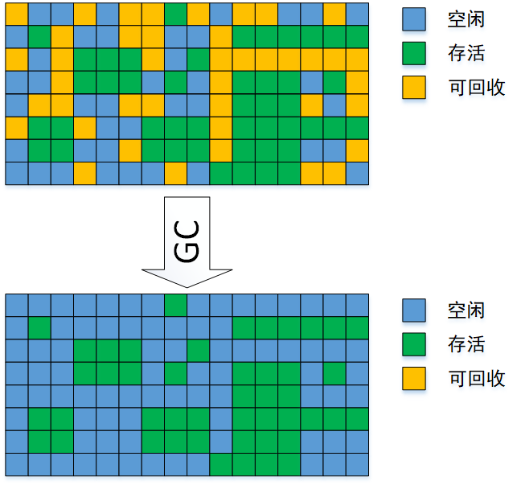

# 标记 - 清除算法

---

“标记 - 清除”算法是最基础的垃圾收集算法，如同它的名字一样，算法的工作过程可以分为“标记”和“清除”两个阶段：首先标记出所有需要回收的对象，然后统一回收所有被标记的对象。

> 标记待回收对象：使用可达性分析算法筛选出所有没有可达链的对象。若对象覆盖了finalize方法且虚拟机还没有调用finalize方法，对象将被加入一个名为F-Queue的队列，后续将由虚拟机创建一个名为Finalizer的线程，逐个执行F-Queue队列每个对象的finalize方法。对象可以在finalize方法中和其他具有可达链的对象建立联系，从而避免本次的垃圾收集。需要注意的是，任何对象的finalize方法只会被执行一次。

“标记 - 清除”算法主要存在两个问题：

1. 效率问题。标记和清除两个过程的效率都不高。
2. 空间问题。可能产生大量的不连续的内存碎片，进而导致空间利用率下降，垃圾收集频率变高。

---

《深入理解Java虚拟机》笔记