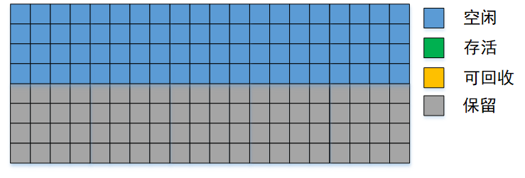
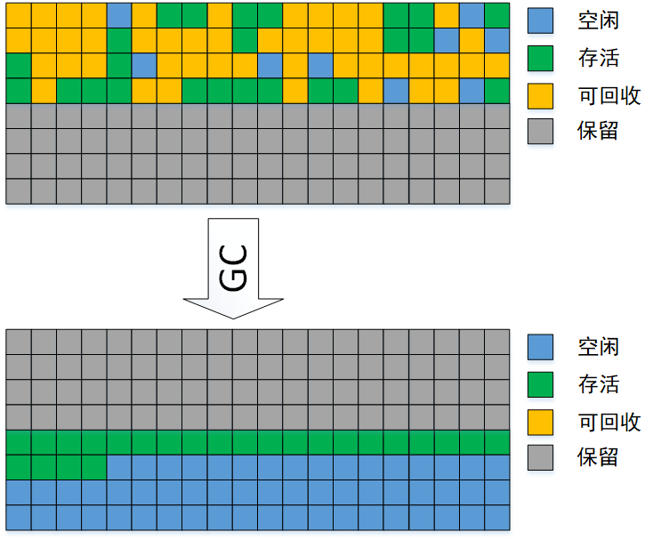
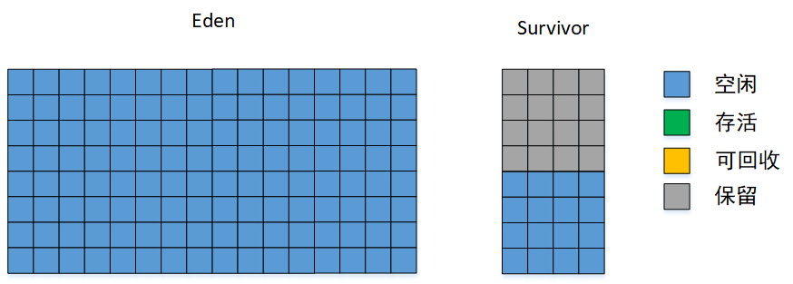
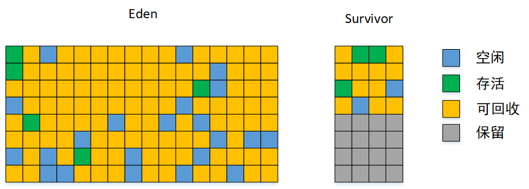
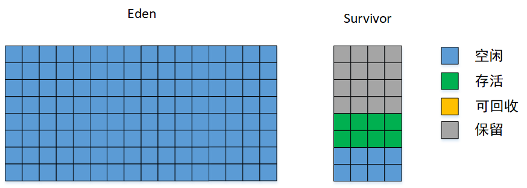

# 垃圾收集算法_复制算法

---

为了解决“标记 - 清除算法”存在的效率和内存碎片问题，“复制算法”出现了。

“复制算法”的基本思想为：

> 将内存按容量等分为两块，每次只使用其中的一块。
>
> 
>
> **当这一块内存使用完的时候，就将所有存活的对象逐一复制到另一块内存，然后把这一块内存的空间一次性清理掉（只要移动堆指针，按顺序分配内存即可）。**
>
> 
>
> “复制算法”实现简单、运行高效、解决了内存碎片问题，但是内存缩小了一半。

现在的商用虚拟机都采用复制算法来回收新生代。IBM的一项研究表明，新生代中98%的对象是“朝生夕死”的，所以并不需要按照1:1的比例来划分内存空间，而是将内存划分为一块较大的名为Eden的空间，两块较小的名为Survivor的空间。

> “朝生夕死”：活不过1次垃圾收集。

**每次将一块Survivor的空间保留，将另一块Survivor与Eden一起拿来使用。进行垃圾回收时，将所有存活的对象复制被到保留的那块Survivor的空间上，然后将Eden和之前使用的Survivor的空间清理掉。两块Survivor交替着与Eden一起使用。**

HotSpot虚拟机默认Eden和Survivor的大小比例为8:1，也就是说，浪费的空间由原来的50%降到10%。

> 使用前：
>
> 
>
> GC前：
>
> 
>
> GC后：
>
> 
>
> 大多数情况下，只有2%的对象存活，一块Survivor（占据10%内存）完全够用，但是超过10%的对象存活的情况还是存在的，届时一块Survivor的空间就不够用了，需要依赖其他内存（这里指老年代）进行分配担保（Handle Promotion）。

如果保留的Survivor没有足够的空间存放上一次新生代收集下来的存活对象，这些对象将直接通过分配担保机制进入老年代。

---

