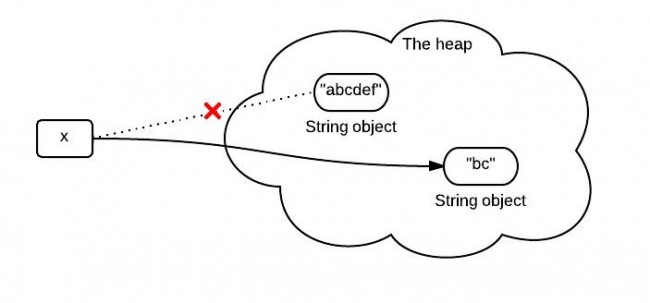
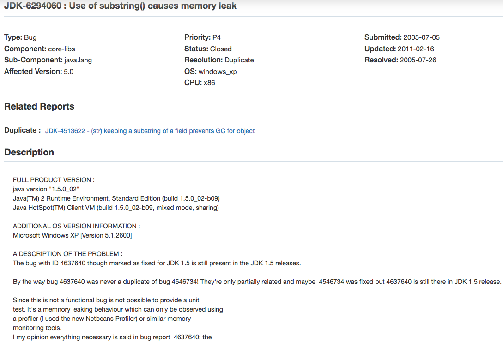
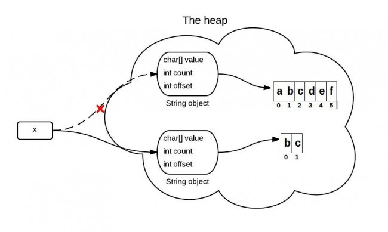

# substring实现原理

---

String是Java中一个比较基础的类，每一个开发人员都会经常接触到。而且，String也是面试中经常会考的知识点。String有很多方法，有些方法比较常用，有些方法不太常用。今天要介绍的subString就是一个比较常用的方法，而且围绕subString也有很多面试题。

<font color = red>`substring(int beginIndex, int endIndex)`</font>方法在不同版本的JDK中的实现是不同的。了解他们的区别可以帮助你更好的使用他。为简单起见，后文中用`substring()`代表`substring(int beginIndex, int endIndex)`方法。

## substring()的作用

`substring(int beginIndex, int endIndex)`方法截取字符串并返回其[beginIndex,endIndex-1]范围内的内容。s

```java
String x = "abcdef";
x = x.substring(1,3);
System.out.println(x);
```

输出内容：

```java
bc
```

## 调用substring时发生了什么？

你可能知道，因为x是不可变的，当使用`x.substring(1,3)`对x赋值的时候，它会指向一个全新的字符串：



然而，这个图不是完全正确的表示堆中发生的事情。因为在jdk6 和 jdk7中调用substring时发生的事情并不一样。

## JDK 6中的subString

tring是通过字符数组实现的。在jdk 6 中，String类包含三个成员变量：<font color = red>`char value[]`， `int offset`，`int count`</font>,他们分别用来：存储真正的字符数组、存储数组的第一个位置索引、存储字符串中包含的字符个数。

当调用substring方法的时候，会创建一个新的string对象，但是<font color = yellow>这个string的值仍然指向堆中的同一个字符数组。这两个对象中只有count和offset 的值是不同的</font>。


### 源码

```java
//JDK 6
String(int offset, int count, char value[]) {
    this.value = value;
    this.offset = offset;
    this.count = count;
}

public String substring(int beginIndex, int endIndex) {
    //check boundary
    return  new String(offset + beginIndex, endIndex - beginIndex, value);
}

```

### 存在的问题

如果有一个很长的字符串，但是你只需要使用很短的一段，于是你使用substring进行切割，但是由于你实际上引用了整个字符串，这个很长的字符串无法被回收。往小了说，造成了存储空间的浪费，往大了说，可能造成内存泄漏。这个问题已经被官方记录在Java Bug Database里面了：



相应的解决办法：

```java
s1 = s1.substring(x,y) + "";
```

## JDK 7 中的substring

上述问题在JDK 7中得到了解决。JDK 7中，substring方法会在堆中创建一个新的数组。



### 源码

```java
    //JDK 7

    /**
     * Allocates a new {@code String} that contains characters from a subarray
     * of the character array argument. The {@code offset} argument is the
     * index of the first character of the subarray and the {@code count}
     * argument specifies the length of the subarray. The contents of the
     * subarray are copied; subsequent modification of the character array does
     * not affect the newly created string.
     *
     * @param value  Array that is the source of characters
     * @param offset The initial offset
     * @param count  The length
     * @throws IndexOutOfBoundsException If the {@code offset} and {@code count} arguments index
     *                                   characters outside the bounds of the {@code value} array
     */
    public String(char value[], int offset, int count) {
        //check boundary
        this.value = Arrays.copyOfRange(value, offset, offset + count);
    }

    /**
     * Returns a string that is a substring of this string. The
     * substring begins at the specified {@code beginIndex} and
     * extends to the character at index {@code endIndex - 1}.
     * Thus the length of the substring is {@code endIndex-beginIndex}.
     * <p>
     * Examples:
     * <blockquote><pre>
     * "hamburger".substring(4, 8) returns "urge"
     * "smiles".substring(1, 5) returns "mile"
     * </pre></blockquote>
     *
     * @param beginIndex the beginning index, inclusive.
     * @param endIndex   the ending index, exclusive.
     * @return the specified substring.
     * @throws IndexOutOfBoundsException if the
     *                                   {@code beginIndex} is negative, or
     *                                   {@code endIndex} is larger than the length of
     *                                   this {@code String} object, or
     *                                   {@code beginIndex} is larger than
     *                                   {@code endIndex}.
     */
    public String substring(int beginIndex, int endIndex) {
        //check boundary
        int subLen = endIndex - beginIndex;
        return ((beginIndex == 0) && (endIndex == value.length)) ?
                this :
                new String(value, beginIndex, subLen);
    }
```

---

参考文献地址：https://hollischuang.github.io/toBeTopJavaer/#/basics/java-basic/substrin

