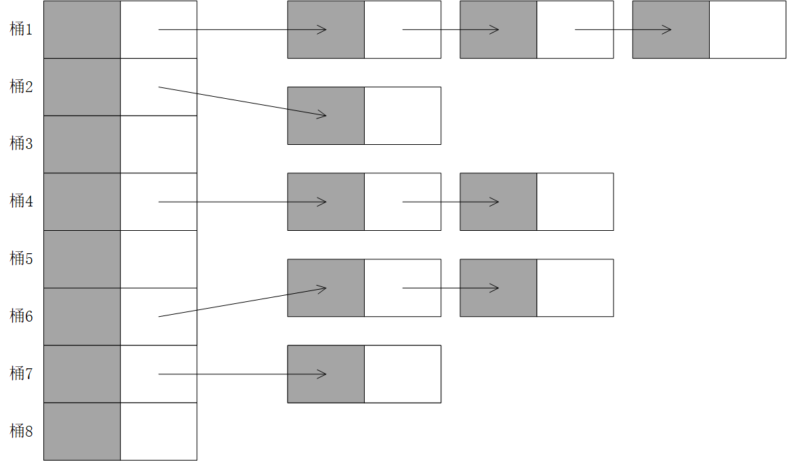

# 散列表

*散列表*（hash table）是一种为**快速查找元素**服务的数据结构。散列表使用*散列码*（hash code）标识表中的元素，散列码是一个由元素本身计算而来的整数。

在Java中，散列表是通过*链表数组*实现的，每个链表被称作*桶*（bucket）：

对象散列码决定了对象最终会存入哪个桶，对象要存入的桶可能已经存入了其他对象，这种现象称为*散列冲突*。发生哈希冲突的时候，需要遍历桶中已存入的所有对象，以确保当前对象还没有存入。

合理的散列函数以及合适的桶数可以降低散列冲突发生的概率，提升程序运行性能。

通常，桶数被设置为预计元素个数的75%~150%，桶数最好是一个素数，标准类库中使用的桶数是2的幂。有的时候可能会预估过小，这是就需要创建一个桶数更多的散列表，*装填因子*（load factor）决定了何时拓展散列表。例如，装填因子为0.75（默认值）,当表中超过75%的位置已经填入元素，表就会以双倍桶数自动进行扩容。