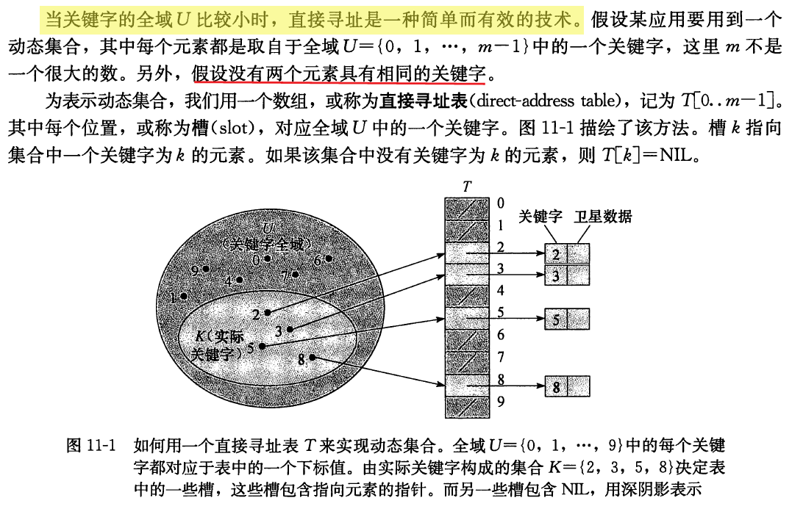
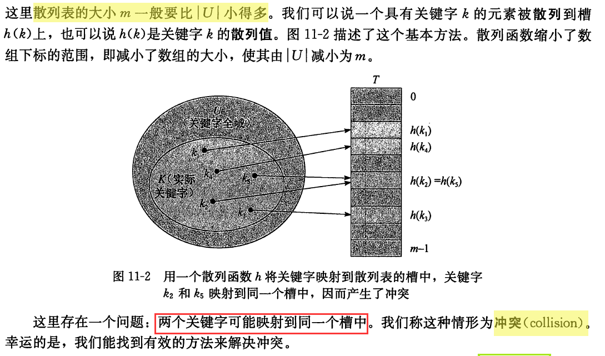
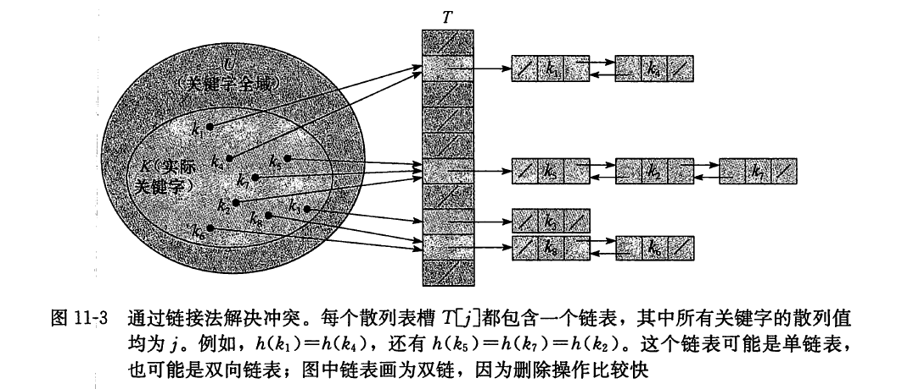
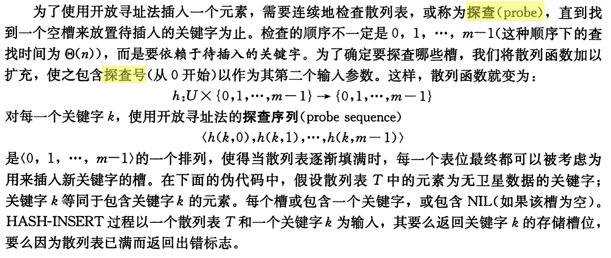
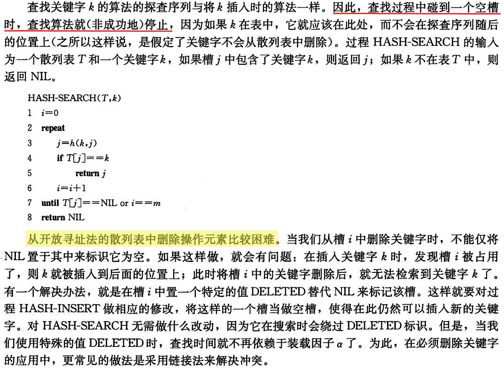
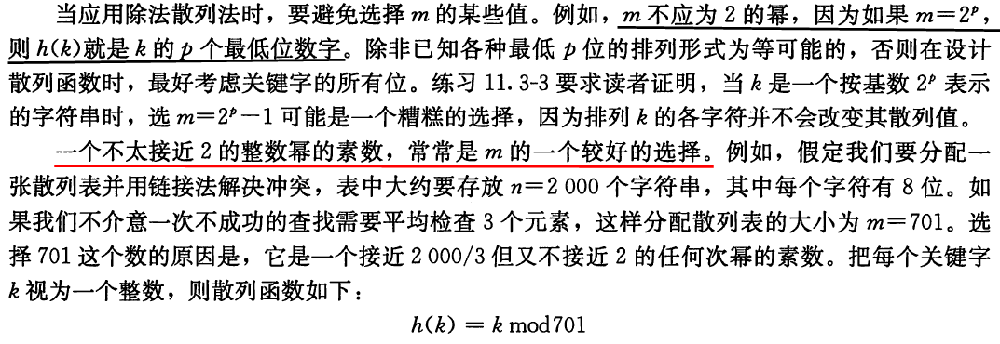
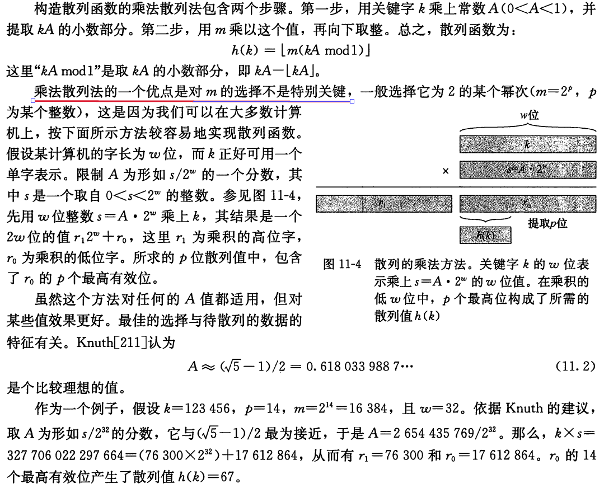

# 散列表

散列表是普通数组概念的推广。由于对普通数组可以直接寻址，使得能在O(1)时间内访问数组中的任意位置。如果存储空间允许 ，我们可以提供一个数组，为每个可能的关键字保留一个位置，以利用直接寻址技术的优势。

当实际存储的关键字数目比全部的可能关键字总数小时，采用散列表就成为直接数组寻址的一种有效替代，因为散列表使用一个**长度与实际存储的关键字数目成正比**的数组来存储。在散列表中，**不是直接以关键字作为下标**，而是**根据关键字计算出相应的下标**。

## 直接寻址

**直接寻址技术的缺点**是非常明显的：如果全域U很大 ，计算机很难甚至不可能存储一张长度为|U|的表。还有，实际存储的关键字集合K相对U来说可能很小，分配的大部分空间会被浪费掉。

|  下标  |  0   |  1   |  2   |  3   |  4   |  5   |  6   |  7   |  8   |  9   |  10  |  11  |  12  |  13  |  14  |  15  |
| :----: | :--: | :--: | :--: | :--: | :--: | :--: | :--: | :--: | :--: | :--: | :--: | :--: | :--: | :--: | :--: | :--: |
| 关键字 |  /   |  /   |  /   |  /   |  /   |  5   |  /   |  /   |  /   |  /   |  /   |  /   |  /   |  /   |  /   |  15  |

## 散列表

### 冲突解决方法

#### 1.链接法

#### 2.开放寻址法

### 散列函数

#### 1.除法散列法

在用来设计散列函数的除法散列法中，通过取**k除以m的余数**，将关键字k映射到m个槽位中的某一个上，即散列函数为：

h(k) = k mod m

#### 2.乘法散列法

